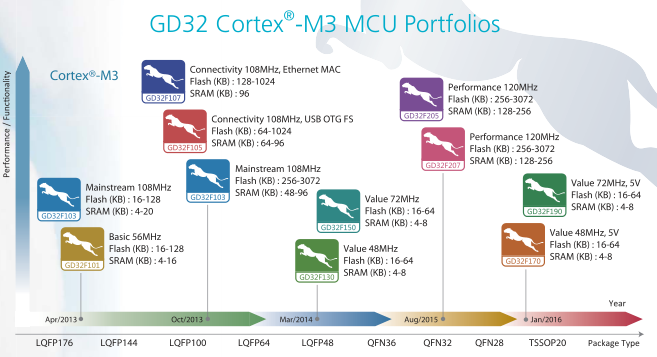

# [GD32F10x](https://github.com/sochub/GD32F1)
 
#### 父级：[GigaDevice](https://github.com/sochub/GigaDevice) 
#### 架构：[Cortex M3](https://github.com/sochub/CM3) 

GigaDevice的 GD32F1系列产品采用Cortex M3内核，主频可达108MHz（F101为56MHz），对标STM32F1系列，在开发工具和风格上具有兼容性。

 

### [收录资源](https://github.com/sochub/GD32F1)

* [参考文档](docs/)
* [参考资源](src/)
* [模板工程](demo/)

### [相关工具](https://github.com/sochub/SDK)

* [编译工具](https://github.com/sochub/arm-none-eabi)

### [选型建议](https://github.com/sochub/GD32F1)

* [STM32F1](https://github.com/sochub/STM32F1)
* [STM32F0](https://github.com/sochub/STM32F0)

##  [SoC资源平台](http://www.qitas.cn)