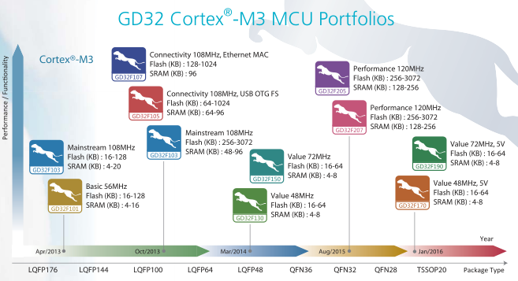

# [GD32F103](https://github.com/SoCXin/GD32F103) 

  

#### [Vendor](https://github.com/SoCXin/Vendor) ：[GigaDevice](https://github.com/SoCXin/GigaDevice)
#### [Core](https://github.com/SoCXin/Cortex) ：[Cortex M3](https://github.com/SoCXin/CM3) 
#### [Level](https://github.com/SoCXin/Level) ：108MHz & 153DMIPS

[GD32F103](https://github.com/SoCXin/GD32F103) 系列产品采用[Cortex M3](https://github.com/SoCXin/CM3) 内核，主频108MHz

 

### [收录资源](https://github.com/SoCXin/GD32F103)

* [文档](docs/)
* [资源](src/)

#### [资源链接](https://github.com/SoCXin/SDK)

* [编译工具](https://github.com/SoCXin/arm-none-eabi)

### [选型建议](https://github.com/SoCXin/GD32F103)

[GD32F103](https://github.com/SoCXin/GD32F103) 相较于[STM32F103](https://github.com/SoCXin/STM32F103) 主频高，劣势是定位趋同，差异化不明显

同质化产品

* [STM32F103](https://github.com/SoCXin/STM32F103)
* [MM32F103](https://github.com/SoCXin/MM32F103)

###  [SoC芯平台](http://SoC.Xin) 